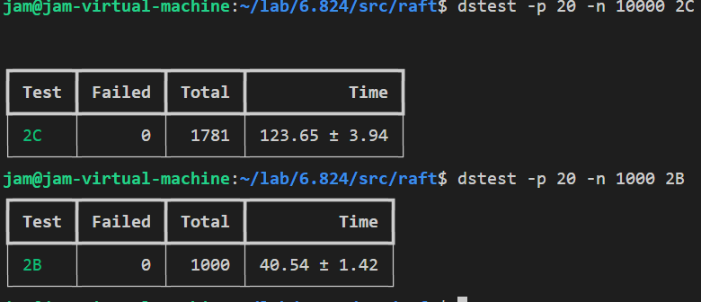

# Lab2C

第三部分是追加持久化操作，以使得我们的机器重启后可以恢复到之前的状态。还需要一个优化，就是快速 backup，换句话说就是当我们发送 AppendEntries RPC 时所做的一致性检查发生失败时，不再是后跳到下一位，我们要迅速的 backup。

具体细节看这里的[指导](https://thesquareplanet.com/blog/students-guide-to-raft/#an-aside-on-optimizations)和上课时的[笔记](http://nil.csail.mit.edu/6.824/2022/notes/l-raft2.txt)。由于这次要写的代码很少，但是却有更大的压力测试，所以大部分都是调 bug，2B 未实现的细节和犯的错，在 2C 这里都会暴露无遗，细心读指导和笔记，慢慢追加代码，慢慢减少错误，慢慢排除边缘条件，就可以了。

测试的时候要 1000 次不出错，就算是通过实验了，我的错误大部分要么几次测试就出现的明显错误和几百次出现的隐藏错误。

以下是 hints。

### Hints

- 首先要做的是保证持久化完成，然后开始做 roll back quickly 的优化。优化的策略，我是二分查找，不建议直接一个一个找，非常慢，二分的写法建议搜一下，细心写，别出现边缘错误。
- 如果你读了上面的指导，你会发现我们要给 AppendEntriesReply 追加两个变量，称为 ConflictTerm 和 ConflictIndex。指导上说了详细的规则，但是有点要记住，是这两个变量协助更改 nextIndex，如果我们收到了未初始化的这两个变量，我们就要忽略到这次更改 nextIndex 的计划。
- 以及在更改 nextIndex 的时候，要询问更改的量是否大于 nextIndex，如果大于则不更改，因为我们是要 BackUp，这个大于的值很可能是由于信息缺失或者是延迟发送导致的错误消息，我们不予理睬。
- 由于这次对细节要求很高，RequestVote RPC 和 AppendEntries RPC 都可能出错，都要考虑。
- 任何过期的消息，无论是谁收到的，都不予理睬，包括 handler 收到的消息以及 handler 回复给 sender 消息。
- 当状态变化时，一定要停下手头的工作。例如我是个 leader，正在发送 AppendEntries RPC，如果收到了别人给我的回复，这个回复的任期比我高，让我下台成为 follower，那么我应该迅速成为 follower，并且立即不再发送 AppendEntries RPC。